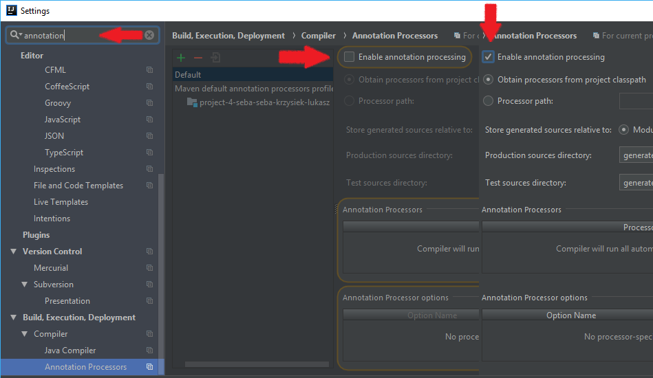
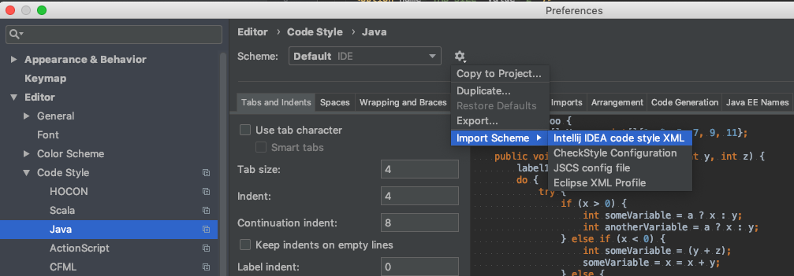
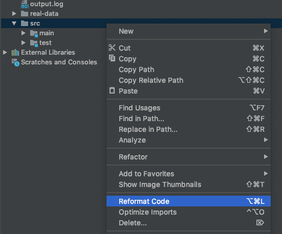
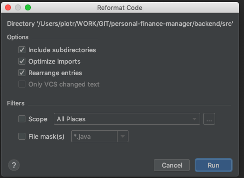
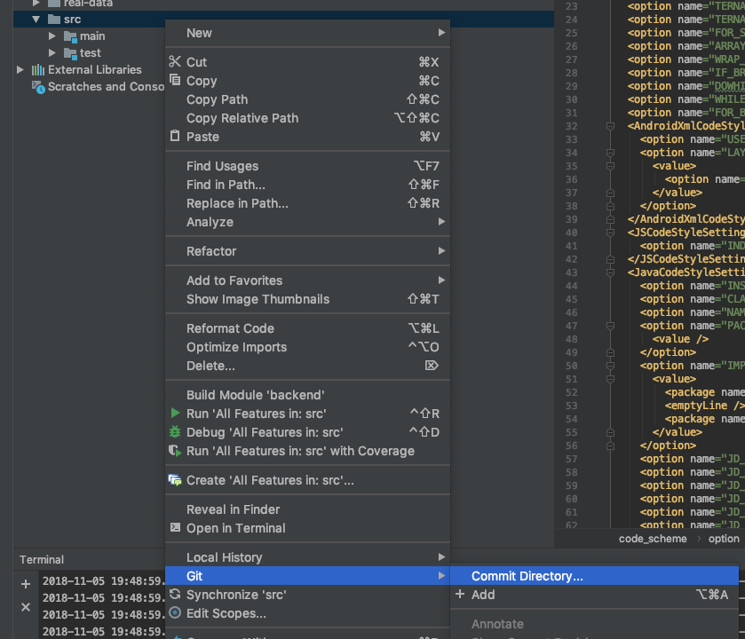
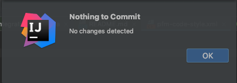

# Personal Finance Manager

Application which allows users to manage their personal finances.

Define accounts, categories and you are ready to track your transactions.

Application was created as a result of passion to managing personal finances by team of passionate engineers. Founder & maintainer of the project is [Piotr Kołacz](https://github.com/pio-kol), special thanks to [Sebastian Pacuk](https://github.com/sebapacuk) for his strong engagement. Other contributors can be found [here](https://github.com/programming-in-practice/personal-finance-manager/graphs/contributors).

If you want to contribute please contact [Piotr](mailto:piotr@passionatesoftwareengineer.com).

If you want to master your programming skills please visit [our website](https://passionatesoftwareengineer.com).

## Demo instance
[Personal Finance Manager demo instance](https://pfm.passionatesoftwareengineer.com)

## API Reference
[Swagger API](https://backend.passionatesoftwareengineer.com)

## Technologies & Frameworks

### Frontend
- [Angular](https://angular.io/)
- [Bootstrap](https://getbootstrap.com/)
- [npm](https://www.npmjs.com/)

### Backend
- [H2](http://www.h2database.com)
- [Spring data](https://projects.spring.io/spring-data/)
- [Gradle](https://gradle.org/)
- [JUnit](https://maven.apache.org/)
- [Mockito](http://site.mockito.org/)
- [Swagger](https://swagger.io/)
- [Hibernate](http://hibernate.org/)
- [Lombok](https://projectlombok.org/)
- [Spring Boot](https://spring.io/projects/spring-boot)

### Tests
- [Gradle](https://gradle.org/)
- [REST Assured](http://rest-assured.io/)
- [Selenium](https://www.seleniumhq.org/)
- [TestNG](https://testng.org)

### Automation
- [Jenkins](https://jenkins.io/)
- [AWS](https://aws.amazon.com/)
- [Bash](https://www.gnu.org/software/bash/)

### Code Quality
- [Checkstyle](http://checkstyle.sourceforge.net/)
- [FindBugs](http://findbugs.sourceforge.net/)
- [PMD](https://pmd.github.io/)
- [Jacoco](https://www.eclemma.org/jacoco/)

## How to start project locally

1. Install [JDK 13](https://adoptopenjdk.net/?variant=openjdk13&jvmVariant=hotspot), [NodeJS](https://nodejs.org/en/), [Angular CLI](https://cli.angular.io/)
2. Open terminal window, go to **_backend_** directory & run **_./gradlew bootRun_**
3. Open second terminal window, go to **_frontend_** directory, run **_npm install_** & **_ng serve --open_**
4. Browser window will open automatically, you can play with the application

## Running application in IntelliJ
- Open IntelliJ, click open project, select **_build.gradle_** file, click **_import as project_**
- Enable annotation processing for Lombok. \

- Wait for Gradle to download half of the internet :)
- Right click on **_Application.java_** and select **_Run_**

## Setting up code formatter in IntelliJ
- Select IntelliJ > Preferences > Editor > Code Style > Java
- Select Import scheme -> IntelliJ IDEA XML \

- Select backend/config/pfm-code-style.xml file and click OK
- Right click on src directory and select Reformat \

- On the dialog select first 3 checkboxes \

- Right click on src directory and select Git > Commit \

- You should see "No changes" dialog \

## Building and pushing docker image (remember to increase the number)
- docker build . -t piokol/pfm:18
- docker run -it --user root piokol/pfm:18 /bin/bash (optional just to check image)
- docker push piokol/pfm:18

## Setting up local Jenkins instance on docker
1. Start docker container 

   docker run --name myjenkins -p 8080:8080 -p 50000:50000 -v /your/home:/var/jenkins_home -v        /var/run/docker.sock:/var/run/docker.sock jenkins/jenkins:lts
   
2. Join docker 

  docker exec -it -u root myjenkins /bin/bash

3.Setup privileges and restart jenkins service

  usermod -aG root jenkins

  chmod 777 /var/run/docker.sock

  systemctl restart jenkins.service or service jenkins restart
  
4. Open Jenkins in webrowser (http://localhost:8080) and login with innital password
5. Click "Install suggested plugins" and wait until Jenkins download plugins.
6. Create admin user
7. Instal "Docker" and "Blue Ocean" plugins. Manage Jenkins > Manage Plugins

